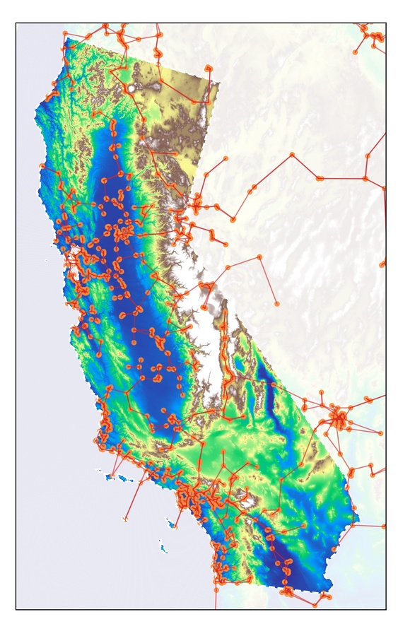

# GLS Kernel Graph Regression

This repository holds the code relevant for the paper entitled *GLS Kernel Regression for Network-Structured Data* by Edward Antonian, Gareth Peters, Mike Chantler and Hongxuan Yan. In it we  we consider the problem of predicting a signal ***y***t, defined across the *N* nodes of a fixed graph, over a series of *T* regularly sampled time points. 

In particular, we analyse the case of a set of pollutant monitoruing stations across Californa. 

The best place to start is in the notebooks folder. There you will find the following files

### `data.ipynb`

This notebook is for downloading and preprocessing the data

### `transformations.ipynb`

This notebook is for visualising the various possible transformations for the data

### `plots.ipynb`

This notebook is for creating the plots of California

### `proofs.ipynb`

This notebook is for verifying proofs from the paper computationally

### `model.ipynb`

This is where the model classes are used and the results from the paper are computed